# LDumay - Personnaliser le Powershell sur Windows ou le Terminal sur Mac OS <a name="top"></a>
 
Sources :

- Site officiel : [https://ohmyposh.dev/](https://ohmyposh.dev/)
- [Guide Windows](https://ohmyposh.dev/docs/installation/windows)
- [Source](https://ohmyposh.dev/docs/installation/macos)
- [YouTube - Make Windows PowerShell look Awesome with Themes! | Using Oh My Posh]
(https://www.youtube.com/watch?v=FvHNfpH8fxM)

## Sommaire

- [1 - Oh My Posh pour Windows](#1)
    - [1.1 - Installation des Fonts](#1-1)
    - [1.2 - Installation de Oh My Posh](#1-2)
    - [1.3 - Vérifier la présences des thèmes](#1-3)
    - [1.4 - Préparer le lien avec le thème](#1-4)
    - [1.5 - Activer un thème](#1-5)
    - [1.6 - Installer de nouveau thèmes](#1-6)
- [2 - Oh My Posh pour Mac OS](#2)
    - [2.1 - Télécharger iTerm2](#2-1)
    - [2.2 - Intallation](#2-2)
    - [2.3 - Configuration de `.zshrc](#2-3)
    - [2.4 - Désintallation](#2-4)
- [3 - Quelques thèmes sympa en exemple](#3)

## 1 - Oh My Posh pour Windows - [Haut de page](#top) <a name="1"></a>

### 1.1 - Installation des Fonts - [Haut de page](#top) <a name="1-1"></a>

Téléchargeable [ici](https://github.com/ryanoasis/nerd-fonts/releases/download/v2.1.0/Meslo.zip)

> Si non, aller sur la partie Fonts de [Oh My Posh](https://ohmyposh.dev/docs/installation/fonts)

Puis configure la police du terminal pour qu'il utilise la police **Meslo LGL NF**.

### 1.2 - Installation de Oh My Posh <a name="1-2"></a>

Ouvrez une invite PowerShell et exécutez la commande suivante :

```
winget install JanDeDobbeleer.OhMyPosh -s winget
```

Cela installe quelques éléments :

- `oh-my-posh.exe` - Exécutable Windows
- `themes` - Les derniers thèmes Oh My Posh

Pour que le `PATH` rechargement soit effectué, un redémarrage de votre terminal est conseillé.

### 1.3 - Vérifier la présences des thèmes <a name="1-3"></a>

```
~\AppData\Local\Programs\oh-my-posh\themes

OU

C:\Users\<user>\AppData\Local\Programs\oh-my-posh\themes
```

### 1.4 - Préparer le lien avec le thème <a name="1-4"></a>

```
~\AppData\Local\Programs\oh-my-posh\themes\jandedobbeleer.omp.json

OU

C:\Users\<user>\AppData\Local\Programs\oh-my-posh\themes\jandedobbeleer.omp.json
```

### 1.5 - Activer un thème <a name="1-5"></a>

Ouvrir le `$PROFILE` de votre terminal :

```
notepad $PROFILE
```

Ajouter dedans :

```
oh-my-posh --init --shell pwsh --config ~\AppData\Local\Programs\oh-my-posh\themes\jandedobbeleer.omp.json | Invoke-Expression
```

Sauvegarder et fermer **notepad**.

Relancer ensuite le terminal.

Et voilà, maintenant kiffer 😎.

### 1.6 - Installer de nouveau thèmes <a name="1-6"></a>

Pour ajouter un thème, faite la commande `oh-my-posh font install <theme>`.

Exemple :

```
oh-my-posh font install jandedobbeleer
```

## 2 - Oh My Posh pour Mac OS <a name="2"></a>

### 2.1 - Télécharger iTerm2 <a name="2-1"></a>

Comme le terminal standard a des problèmes pour afficher correctement les caractères ANSI, nous vous conseillons d'utiliser iTerm2 ou tout autre terminal macOS moderne prenant en charge les caractères ANSI.

- [iTerm2](https://iterm2.com/)

### 2.2 - Installation <a name="2-2"></a>

```
brew install oh-my-posh
brew install jandedobbeleer/oh-my-posh/oh-my-posh
brew update && brew upgrade && exec zsh
```

### 2.3 - Configuration de `.zshrc` <a name="2-3"></a>

Ajoutez ce qui suit à `~/.zshrc` :

```
if [ $TERM_PROGRAM != "Apple_Terminal" ]; then
  eval "$(oh-my-posh init zsh)"
fi
```

Et voilà, maintenant kiffer 😎.

### 2.4 - Désintallation <a name="2-4"></a>

```
brew remove oh-my-posh                                                                                  in zsh at 16:53:08
brew remove jandedobbeleer/oh-my-posh/oh-my-posh
brew update && brew upgrade && exec zsh
```

### 3 - Quelques thèmes sympa en exemple <a name="3"></a>

Quelques sympa :

- [blue-owl](https://ohmyposh.dev/docs/themes#blue-owl)


- [blueish](https://ohmyposh.dev/docs/themes#blueish)
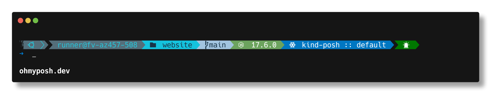

- [bubbles](https://ohmyposh.dev/docs/themes#bubbles)
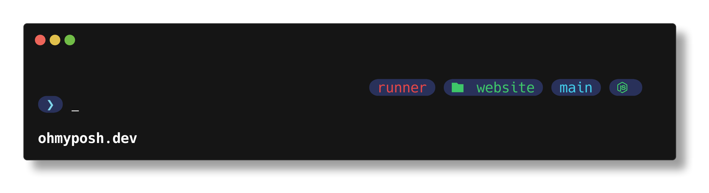

- [bubblesextra](https://ohmyposh.dev/docs/themes#bubblesextra)
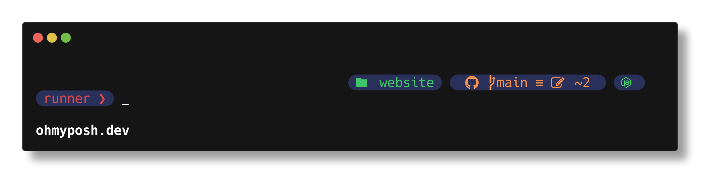

- [bubblesline](https://ohmyposh.dev/docs/themes#bubblesline)
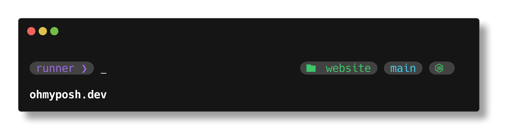

- [catppuccin](https://ohmyposh.dev/docs/themes#catppuccin)
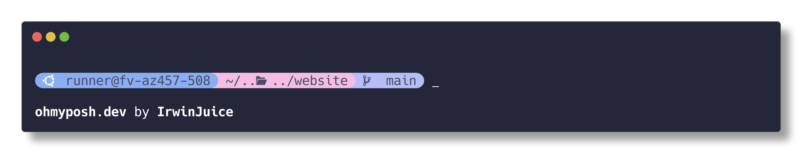

- [cert](https://ohmyposh.dev/docs/themes#cert)
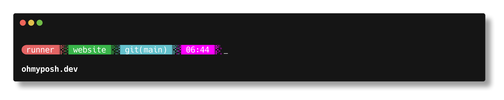

- [chips](https://ohmyposh.dev/docs/themes#chips)


- [clean-detailed](https://ohmyposh.dev/docs/themes#clean-detailed)
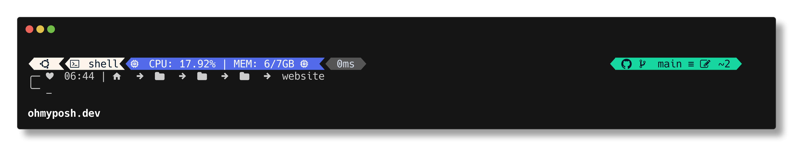

- [cobalt2](https://ohmyposh.dev/docs/themes#cobalt2)
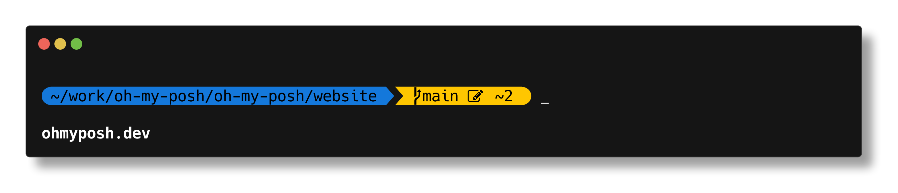

- [dracula](https://ohmyposh.dev/docs/themes#dracula)
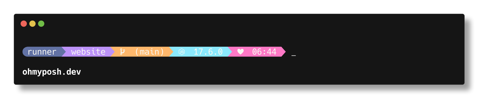

- [easy-term](https://ohmyposh.dev/docs/themes#easy-term)
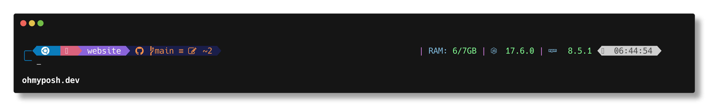

- [emodipt-extend](https://ohmyposh.dev/docs/themes#emodipt-extend)
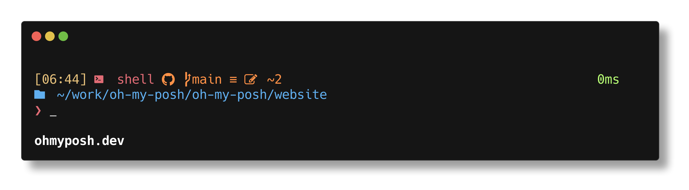

- [emodipt](https://ohmyposh.dev/docs/themes#emodipt)
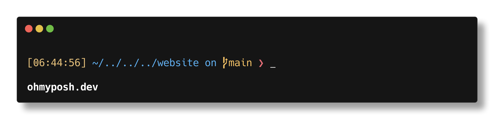

- [jandedobbeleer](https://ohmyposh.dev/docs/themes#jandedobbeleer)
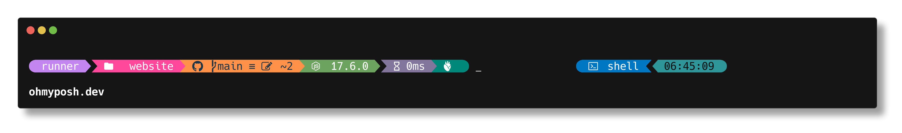

- [the-unnamed](https://ohmyposh.dev/docs/themes#the-unnamed)
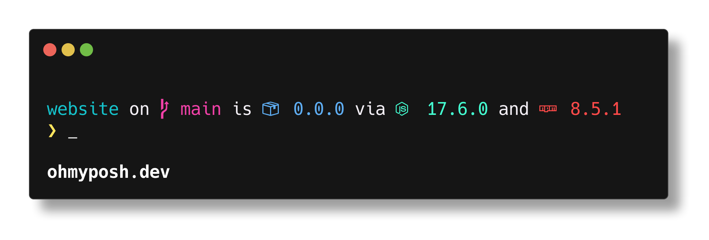

Liste de thèmes [ici](https://ohmyposh.dev/docs/themes).

---

```
scoop update oh-my-posh
```